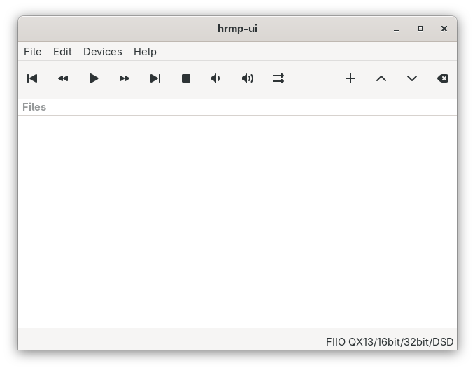

\newpage

# hrmp-ui

This chapter describes **hrmp-ui**, the GTK-based graphical user interface for the HighResMusicPlayer (hrmp).
It runs the command-line player in the background and controls it using the same keyboard commands that hrmp understands.

## Overview

hrmp-ui provides:

- A **toolbar** with playback controls, skip controls, volume controls, and play mode selection.
- A **playlist view** that lists the files to be played.
- Menus for configuring preferences, listing devices, and viewing help.

Launching `hrmp-ui` opens the main window but does not start playback until you press **Play** with a file list.

## Toolbar Controls

The toolbar is laid out from left to right as follows:

1. **Prev**
   - Skips to the previous track in the playlist.
   - Mapped to the hrmp "previous" command (**BACKSLASH** key).

2. **Skip back**
   - Seeks backward in the currently playing track (rewind by 1 minute).
   - Sends the **ARROW_DOWN** key sequence to hrmp.

3. **Play / Pause**
   - When hrmp is not running, starts playback of the current playlist using the selected device and mode.
   - When hrmp is running, toggles between play and pause.
   - Icon changes between "play" and "pause" to reflect the current state.

4. **Skip ahead**
   - Seeks forward in the currently playing track (forward by 1 minute).
   - Sends the **ARROW_UP** key sequence to hrmp.

5. **Next**
   - Skips to the next track in the playlist.
   - Mapped to the hrmp "next" command (**ENTER** key).

6. **Stop**
   - Sends `q` to hrmp to quit playback and then tears down the hrmp process.
   - Clears the output log in the UI.

7. **Volume down**
   - Decreases volume (mapped to `,` in hrmp).

8. **Volume up**
   - Increases volume (mapped to `.` in hrmp).

9. **Play mode**
   - Cycles between three playback modes:
     - **Once**: play the playlist once and stop.
     - **Repeat**: when the playlist reaches the end, it restarts from the beginning.
     - **Shuffle**: randomize the order of playlist entries (keeping the currently selected file as the first track).
   - The button icon changes to indicate the current mode (consecutive, repeat, shuffle).

10. **Add**
    - Opens a file chooser for selecting supported audio files and appends them to the playlist.

11. **Move up**
    - Moves the selected playlist entry one row up (no-op if it is already the first entry).

12. **Move down**
    - Moves the selected playlist entry one row down (no-op if it is already the last entry).

13. **Clear**
    - Stops hrmp if it is running and clears the playlist.

## Playlist View

You can add one file or multiple files at once, and the order shown reflects the playback order (subject to shuffle mode).

You can select how the file names are presented in the preference window - either the full path or just the basename.

- **Double-click** a file to stop any existing playback (if necessary) and start playback from the file you double-clicked.
- **Right-click** a file to remove it from the playlist, unless it is the file that is currently playing, in which case the playlist is left unchanged.

## Status Panel

Below the file list there is a status panel showing the current file playing and the device used.

- Example: `FIIO QX13/16bit/32bit/DSD` indicates that 24‑bit formats are not supported, but 16‑bit, 32‑bit, and DSD are.
- The text is right-aligned and is updated whenever the default device or device capabilities change.

## Menus

### Mnemonics and shortcuts

- **Menu mnemonics** (Alt + underlined letter):
  - **File**: Alt+F
    - **Quit**: Alt+Q (then Enter or Space to activate)
  - **Edit**: Alt+E
    - **Preferences**: Alt+P (then Enter or Space)
  - **Devices**: Alt+D
    - **List devices**: Alt+L (then Enter or Space)
  - **Help**: Alt+H
    - **About**: Alt+H, then A
    - **License**: Alt+H, then L
    - **Debug**: Alt+H, then D

- **Toolbar button accelerators** (global shortcuts):
  - **Prev**: Ctrl+B
  - **Skip back**: Alt+Left
  - **Play / Pause**: Ctrl+P
  - **Skip ahead**: Alt+Right
  - **Next**: Ctrl+N
  - **Stop**: Ctrl+S
  - **Volume down**: Ctrl+-
  - **Volume up**: Ctrl++
  - **Play mode** (Once/Repeat/Shuffle): Ctrl+M
  - **Add**: Ctrl+A
  - **Move up**: Alt+Up
  - **Move down**: Alt+Down
  - **Clear**: Ctrl+L

These shortcuts complement the hrmp keyboard controls and work regardless of which widget currently has focus inside hrmp-ui.

### File Menu

- **Load**
  - Opens a file chooser restricted to playlist files (`*.hrmp`).
  - Replaces the current playlist view with the contents of the selected `.hrmp` file.

- **Save**
  - Saves the current playlist view to a `.hrmp` file (one filename per line).
  - A filename is always required; the save dialog supports overwriting an existing file.

- **Quit**
  - Quits hrmp-ui.
  - If hrmp is still running, it is first asked to quit cleanly.

### Edit Menu

- **Preferences**
  - Opens the preferences dialog, where you can configure:
    - **hrmp binary path**: Path to the hrmp executable to launch.
    - **Default device**: The default device name to pass to `hrmp -D`.
    - **Files display mode**: whether the playlist shows full paths or just basenames.
  - Preferences are stored in `~/.hrmp/hrmp-ui.conf`.

### Devices Menu

- **List devices**
  - Runs `hrmp -s` to query device capabilities.
  - Displays one tab per device, showing:
    - Overview information (device name, description, hardware, mixer control, active state, volume, paused state).
    - Per-format support for 16‑bit, 24‑bit, 32‑bit, and DSD formats.

### Help Menu

- **About**
  - Shows version information and the AUTHORS list.

- **License**
  - Shows the text of the GNU General Public License version 3.

- **Debug**
  - The debug panel shows hrmp's textual output.

## Playback Modes and Repeat Behavior

The play mode (once / repeat / shuffle) is stored in the UI and used when starting hrmp.

- **Once**: the playlist is played a single time; when hrmp exits, playback stops.
- **Repeat**: when hrmp exits after finishing the playlist, the UI automatically restarts hrmp with the same playlist, even if repeat was enabled during the last track.
- **Shuffle**: before starting hrmp, the UI shuffles the playlist entries after the first file so that the starting track stays the same.

## Configuration File

hrmp-ui reads and writes a simple key file at:

- `~/.hrmp/hrmp-ui.conf`

Stored keys include:

- `General.hrmp_path`: path to the hrmp binary.
- `General.default_device`: default playback device name.
- `General.files`: either `Full` or `Short` to control playlist display.

This file is created or updated automatically when you change preferences.

## Relation to hrmp

hrmp-ui is a thin wrapper around hrmp itself:

- All audio decoding and playback is performed by `hrmp`.
- hrmp-ui builds the command line and controls hrmp via standard input.
- Device capabilities and status are queried by invoking `hrmp -s`.

For details on supported formats, configuration options, and command-line usage, see the `hrmp(1)` and `hrmp.conf(5)` manual pages.
